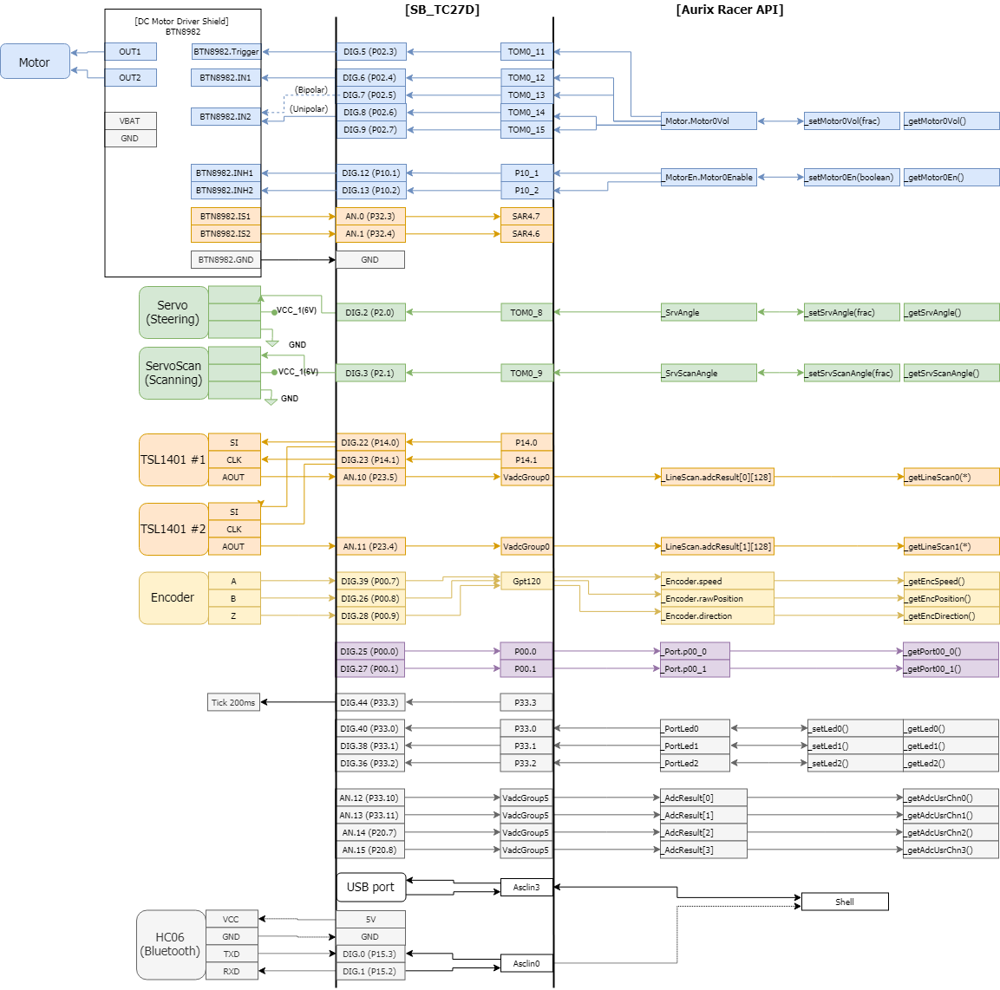

# Connection Guide

## Components
*   Microcontroller board: [ShieldBuddy_TC275](http://www.hitex.co.uk/embedded-technology/hardware/boards-modules/embedded-modules-by-processor/hitex-shieldbuddy-tc275/)
*   Motor Driver: [DC Motor Control Shield with BTN8982TA](https://www.infineon.com/cms/en/product/evaluation-boards/dc-motorcontr_btn8982/)
*   DC Motor included in Kit
*   Servo motor for steering included in Kit

**[Optional]**

* [Bluetooth Slave UART Board](http://eleparts.co.kr/goods/view?no=3250018)

* Servo motor for scanning

* Line Scan Camera: TSL1401 X 2

* Incremental Encoder: E30S4-1024-3-N-5 1024(/512/256) PPR

* etc

## Connection Diagram

